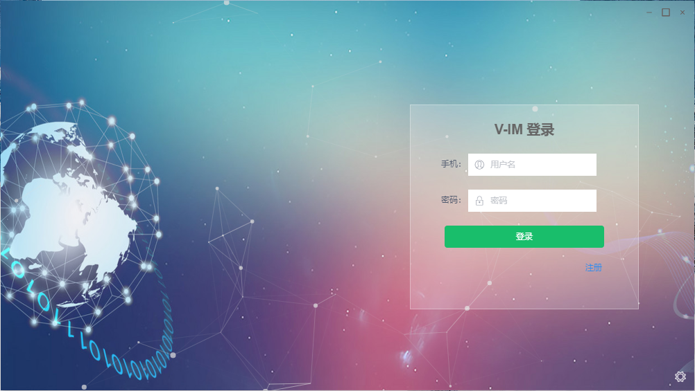
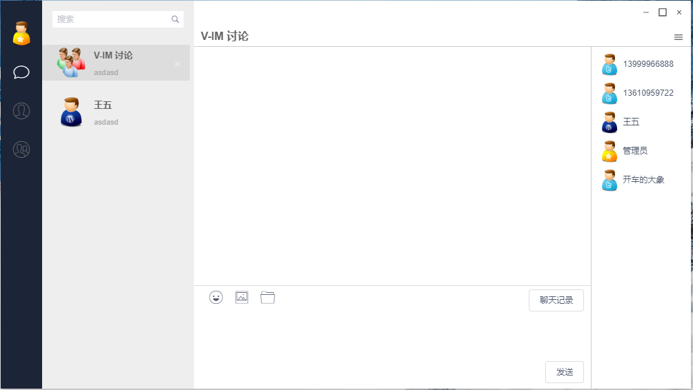
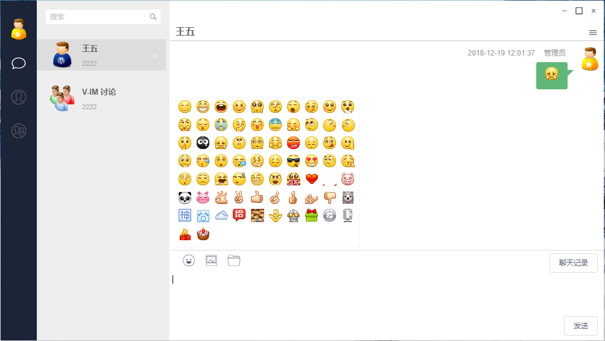
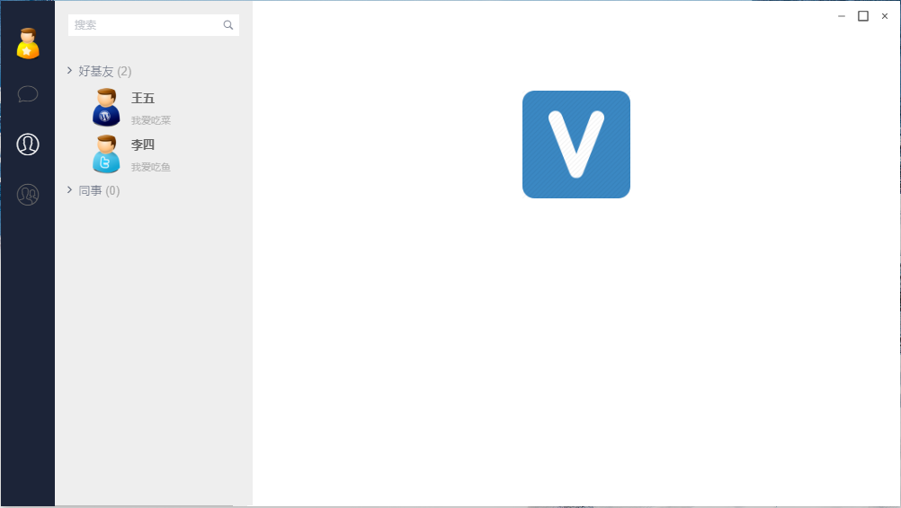
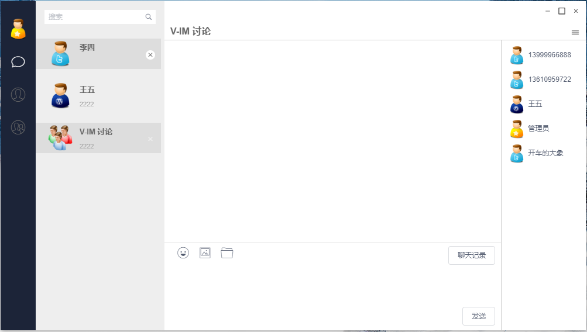
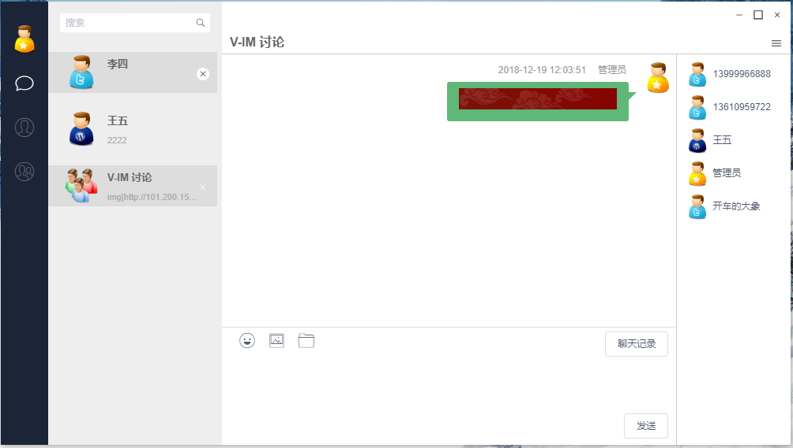

### 需要购买的阿里云的同学 请点击支持 [阿里云优惠券2000元](https://chuangke.aliyun.com/invite?userCode=d4l0ykh3)
### 务必记得点赞哦
### tips
>   1. 如果出现 Parsing error: x-invalid-end-tag  vue/no-parsing-error 类似的错误，可用用 webstorm 右键src 目录 Fix eslint problems，
>
### 0.6.0 发布
>   1. 放弃 electron-vue 拥抱 vue-cli-plugin-electron-builder，更加容易安装依赖，记得用 yarn。
>   2. 陆续更新文档：https://my.oschina.net/alyouge/blog/3224771
>   3. electron 版本为 8
#### 文档
>   1. 打包好的文件   [下载](https://gitee.com/lele-666/V-IM/raw/master/v-im%20Setup%200.5.3.exe)。
>   2. 打包好的web文件，在dist/web 目标下（运行的时候需要有容器，例如nginx tomcat之类的）。
>   3. 消息推送接口，调用方式：http://localhost:8080/api/user/sendMsg?access_token=你的token&userId=接收人&msg=我是消息
>   4. 获取token：http://localhost:8080/oauth/token?client_id=v-client&client_secret=v-client-ppp&grant_type=password&scope=select&username=wangwu&password=123456
>   5. 测试地址：http://101.200.151.183   wangwu 123456 。
>   6. 安装依赖命令：yarn 。
>   7. 开发环境命令：npm run serve 和 npm run electron:serve。
>   8. 打包安装文件：npm run electron:build，打包完成的文件在/dist_electron 下。
>   9. 打包web文件：npm run build，打包完成的文件在/dist 下。

### 注意事项

> 1. 打包时候项目路径不能有中文，包括你 windows 用户都不能有中文字符，因为npm 缓存都是在用户目录下（如果原先的用户名是中文，再修改成英文也不好用，因为原先的npm包都还在中文目录下，可以新建个window 英文账号，登录新账号打包）。
> 2. 使用yarn 安装依赖，npm 不是很好用，尝试过，都不能打包成功。如果yarn 不能安装依赖成功，可以多试几次，或者翻墙后再打包！
> 3. 基于 t-io websocket 协议， 据说能支持百万级并发，但是此项目并没有进行此方面的测试，还请知晓 ！

### 服务端代码在此
>   1. https://gitee.com/lele-666/V-IM-Server
>   2. 测试账号： wangwu/123456  或者可以点注册，自行注册账号。

### 截图

### 功能点
> 1. 文本聊天
> 2. 聊天表情
> 3. 发送图片（http）
> 4. 发送文件（http）
> 5. 单聊
> 6. 群聊
> 7. 用户分组（后端支持）
> 8. 离线消息（单聊）
> 9. 聊天记录（单聊、群聊）
> 10. 支持心跳检测，断线重连
> 11. 使用SpringBoot security oauth2.0 支持单点登录。
> 12. 用户搜索。

### 登录测试
> 1. 测试服务器IP:101.200.151.183,在登录界面右下角有设置的地址，默认的是本地（没有服务不好用），请知晓。
> 2. 自己可以注册个用户进行测试，默认。
> 3. 没有提供在线添加好友和管理群组的功能，后续开发，好友关系维护都在后台服务里。
> 4. 打包好的测试文件-->[下载exe安装文件 64位](https://gitee.com/lele-666/V-IM/blob/master/v-im%20Setup%200.3.9.exe)。

### 参考项目及技术
> 1. layIM（主要是聊天表情，文件处理方面）。
> 2. 使用SpringBoot、oauth2.0、t-io 开发后端服务。
> 3. vue、iview 开发前端。
> 4. 界面高仿微信，如有侵权请告知。
> 5. 其他：使用 fetch 发送ajax 请求，支持跨域，electron 支持打包成为exe，也支持linux 和 mac 目前还没测试，有条件的同学可以测试。

### 后续目标
> 1. 开发基于websocket 的安卓和IOS 版本。
> 2. 打包命令调整，支持自动打包不同的版本（已解决）。
> 3. 后端项目做成SpringBoot启动方式（方便集成），后端提供 restful 方式API，支持数据库分库、分表，支持分布式部署 (已经解决SpringBoot) 。
> 4. 需要高手加入项目，现在只有一个人维护前后端实在是吃力。
> 5. 优化稳定性，包括 token 刷新机制调整，目前还没好的方案控制同一用户下的并发问题（出问题几率很低，但是不代表不会出问题）(已经解决)。
> 6. 支持https 本身t-io是支持的，目前还没测试，后续会测试。
> 7. 持续改进，优化！

### 交流群
> 1. QQ群：617853658 验证请说明 V-IM 
> 2. 如果您觉得好用，可以给点个star，或者给个捐赠。

